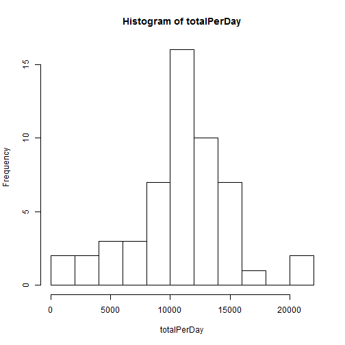
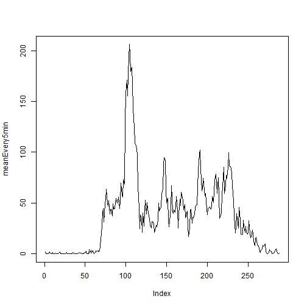
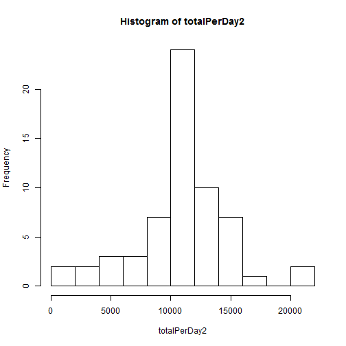

Reproducible Research Assignment 1
========================================================

## Introduction
It is now possible to collect a large amount of data about personal movement using activity monitoring devices such as a Fitbit, Nike Fuelband, or Jawbone Up. These type of devices are part of the “quantified self” movement – a group of enthusiasts who take measurements about themselves regularly to improve their health, to find patterns in their behavior, or because they are tech geeks. But these data remain under-utilized both because the raw data are hard to obtain and there is a lack of statistical methods and software for processing and interpreting the data.

This assignment makes use of data from a personal activity monitoring device. This device collects data at 5 minute intervals through out the day. The data consists of two months of data from an anonymous individual collected during the months of October and November, 2012 and include the number of steps taken in 5 minute intervals each day.

## Data

The data for this assignment can be downloaded from the course web site:

- Dataset: Activity monitoring data [52K]

The variables included in this dataset are:

- steps: Number of steps taking in a 5-minute interval (missing values are coded as NA)
- date: The date on which the measurement was taken in YYYY-MM-DD format
- interval: Identifier for the 5-minute interval in which measurement was taken

The dataset is stored in a comma-separated-value (CSV) file and there are a total of 17,568 observations in this dataset.

## Questions

### Loading and preprocessing the data
First, we need to load the data and have a look at it

```r
data <- read.csv("activity.csv")
str(data)
```

```
## 'data.frame':	17568 obs. of  3 variables:
##  $ steps   : int  NA NA NA NA NA NA NA NA NA NA ...
##  $ date    : Factor w/ 61 levels "2012-10-01","2012-10-02",..: 1 1 1 1 1 1 1 1 1 1 ...
##  $ interval: int  0 5 10 15 20 25 30 35 40 45 ...
```

```r
head(data)
```

```
##   steps       date interval
## 1    NA 2012-10-01        0
## 2    NA 2012-10-01        5
## 3    NA 2012-10-01       10
## 4    NA 2012-10-01       15
## 5    NA 2012-10-01       20
## 6    NA 2012-10-01       25
```

### What is mean total number of steps taken per day?
First, calculate the total steps per day.

```r
attach(data)
totalPerDay <- tapply(steps,list(date),sum)
detach(data)
```

Plot the histogram of the total steps taken per day

```r
hist(totalPerDay,breaks=10)
```

 

Calculate the mean and median total steps taken per day

```r
meanPerDay = mean(totalPerDay,na.rm = TRUE)
meanPerDay
```

```
## [1] 10766.19
```

```r
medianPerDay <- median(totalPerDay,na.rm = TRUE)
medianPerDay
```

```
## [1] 10765
```

### What is the average daily activity pattern?

First, we need to calculate the average steps taken in every 5 minutes.

```r
attach(data)
meanEvery5min <- tapply(steps,list(interval),mean,na.rm=TRUE)
detach(data)
```

Then, we can make a time series plot

```r
plot(meanEvery5min,type="l")
```

 

At last, we can find which interval contains the maximum value of the steps

```r
which.max(meanEvery5min)
```

```
## 835 
## 104
```

```r
meanEvery5min[104]
```

```
##      835 
## 206.1698
```

```r
max(meanEvery5min)
```

```
## [1] 206.1698
```

### Imputing missing values
Calculate and report the total number of missing values in the dataset 

```r
calMissing <- sum(is.na(data$steps))
calMissing
```

```
## [1] 2304
```

Devise a strategy for filling in all of the missing values in the dataset
We choose a stretagy to impute the missing data with the average number of steps in that 5 minute interval.

```r
na <- is.na(data$steps)
shiftmeanEvery5min <- c(meanEvery5min[288],meanEvery5min[1:287])
imputedSteps <- rep(0,length(data$steps))
for (i in 1:length(data$steps))
{
  if(na[i])
    {
      imputedSteps[i] <- shiftmeanEvery5min[i%%length(meanEvery5min)+1]
    }
  else
    {
      imputedSteps[i] <- data$steps[i]
    } 
}

#data <- transform(data, data$imputedSteps = imputedSteps)
data <- cbind(data,imputedSteps)
str(data)
```

```
## 'data.frame':	17568 obs. of  4 variables:
##  $ steps       : int  NA NA NA NA NA NA NA NA NA NA ...
##  $ date        : Factor w/ 61 levels "2012-10-01","2012-10-02",..: 1 1 1 1 1 1 1 1 1 1 ...
##  $ interval    : int  0 5 10 15 20 25 30 35 40 45 ...
##  $ imputedSteps: num  1.717 0.3396 0.1321 0.1509 0.0755 ...
```

```r
head(data)
```

```
##   steps       date interval imputedSteps
## 1    NA 2012-10-01        0    1.7169811
## 2    NA 2012-10-01        5    0.3396226
## 3    NA 2012-10-01       10    0.1320755
## 4    NA 2012-10-01       15    0.1509434
## 5    NA 2012-10-01       20    0.0754717
## 6    NA 2012-10-01       25    2.0943396
```

Make a histogram of the total number of steps taken each day

```r
attach(data)
```

```
## 下列对象被屏蔽了_by_ .GlobalEnv:
## 
##     imputedSteps
```

```r
totalPerDay2 <- tapply(imputedSteps,list(date),sum)
detach(data)
hist(totalPerDay2,breaks=10)
```

 

```r
mean(totalPerDay2)
```

```
## [1] 10766.19
```

```r
median(totalPerDay2)
```

```
## [1] 10766.19
```

We can see that the mean and median value in the imputed data do not differ very much from in the original data. The histogram of the imputed data also does not differ too much with the histogram of the original data in shape, but the number enlaged on the total daily number of steps.

### Are there differences in activity patterns between weekdays and weekends?

```r
#isweekday <- factor(c("weekday", "weekends"))
date <- levels(data$date)
daytype <- weekdays(as.Date(date))
for(i in 1:length(daytype))
  {
    if(daytype[i] %in% c("星期一", "星期二", "星期三", "星期四", "星期五"))
      {
        daytype[i] <- "weekday"
      }
    else
      {
        daytype[i] <- "weekend"
      }
  }
daytype <- as.factor(daytype)
isweekday <- rep(daytype,each=length(meanEvery5min))

data <- cbind(data,isweekday)
str(data)
```

```
## 'data.frame':	17568 obs. of  5 variables:
##  $ steps       : int  NA NA NA NA NA NA NA NA NA NA ...
##  $ date        : Factor w/ 61 levels "2012-10-01","2012-10-02",..: 1 1 1 1 1 1 1 1 1 1 ...
##  $ interval    : int  0 5 10 15 20 25 30 35 40 45 ...
##  $ imputedSteps: num  1.717 0.3396 0.1321 0.1509 0.0755 ...
##  $ isweekday   : Factor w/ 2 levels "weekday","weekend": 1 1 1 1 1 1 1 1 1 1 ...
```

```r
head(data)
```

```
##   steps       date interval imputedSteps isweekday
## 1    NA 2012-10-01        0    1.7169811   weekday
## 2    NA 2012-10-01        5    0.3396226   weekday
## 3    NA 2012-10-01       10    0.1320755   weekday
## 4    NA 2012-10-01       15    0.1509434   weekday
## 5    NA 2012-10-01       20    0.0754717   weekday
## 6    NA 2012-10-01       25    2.0943396   weekday
```

Make a panel plot containing a time series plot (i.e. type = "l") of the 5-minute interval (x-axis) and the average number of steps taken, averaged across all weekday days or weekend days (y-axis).

```r
attach(data)
```

```
## 下列对象被屏蔽了_by_ .GlobalEnv:
## 
##     date, imputedSteps, isweekday
```

```r
daytypeDiff <- aggregate(imputedSteps, list(interval,isweekday), mean)
detach(data)
library(lattice)
```

```
## Warning: package 'lattice' was built under R version 3.0.3
```

```r
#par(mfrow)
xyplot(x ~ Group.1|Group.2,data=daytypeDiff,type="l",layout=c(1,2),xlab="Interval",ylab="Number of Steps")
```

 


